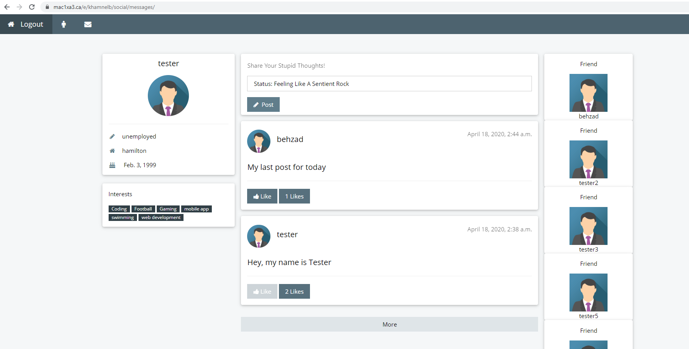

## Usage
   Make sure you have conda installed\
   Enable django environment using condo activate djangoenv\
   Run locally with\
   &nbsp;&nbsp;&nbsp;&nbsp;python manage.py runserver localhost:8000\
   Login with tester, password TestPassword\
   Login with tester2, Password TestPassword

## Objective 01
Description: 
- login and signup pages are under Project03/login. 
 - login page is displayed in login.djhtml inside the templates folder.
 - signup page is displayed in signup.djhtml which uses the Django form to create a new user.
 - function def signup_view in views.py hands the POST requests sent by the form and creates a new user.
 - After signup, it redirects you to the message page which is the dashboard.

## Objective 02
Description: 
 - social_base.djhtml is used by message.djhtml, people.djhtml and account.djhtml and they are rendered by messages_view, people_view and account_view.
 - this feature shows the user profile and interests.

## Objective 03
Description: 
 - this feature is displayed in account.djhtml and rendered by account_view in views.py.
 - this feature consists of a form for password change and a form for updaring user info such as employment,location and birthday.
 - the account_view function handles the POST requests from the forms to e/macid/social/account.

## Objective 04
Description: 
 - this feature is displayed in people.djhtml and rendered by people_view in views.py.
 - the more button sends an AJAX POST in people.js to more_ppl_view and then reloades the page if it was successful.
 - function people_view displays the users in the middle column who are not friends with the current user.
 - the page starts our displaying only two people. 
 - when the user has logged out successufully, the amount of people displaying in the middle column will be changed back to default(2).

## Objective 05
Description: 
 - this feature is for sending friend requests. It is displayed in people.djhtml.
 - the friend request button under each user is linked to a JQuery even in people.js to send a POST request to function friend_request_view.
 - by pressing the friend request button in people.djhtml, the user id of a user will be sent and friend_request_view handles those POSTs and adds new enteries to the FriendRequest model.

## Objective 06
Description:     
 - this features is for the Accept and Decline buttons it is displayed by people.djhtml and rendered by accept_decline_view.
 - accept_decline_view handles the POST requests sent by people.djhtml. If the first letter is an A it means that the friend request is accepted so it will be added to the current user friends list and the person who sends the request. If the first letter is a D it means that the user has rejected the request so the friend request will be deleted.

## Objective 07
Description: 
 - this feature is displayed by messaged.djhtml and rendered by messages_view in views.py.
 - it displayes all the current user's friends by iterating over user_info.friends.all and showing the user.

## Objective 08
Description: 
 - this feature is for submitting posts which is displayed by message.djhtml and rendered by post_submit_view. post_submit_view adds new enteries to the Post model.
 - message.js sends a AJAX POST request when the user clicks on the post button and it sends the text to the post_submit_view.
 - It reloads the page and shows an alert if the post was successful.

## Objective 09
Description: 
 - this feature is for display the posts from Objective 08. It is displayed in messaged.djhtml and rendered by messages_view.
 - messages_view gets a session variable similar to objective 04 and increament eveytime the post button is clicked. By default is only displaying 2 posts which are ordered by their post data.
 - When the user logs out, the number of posts displayed will be changed back to 2.

## Objective 10
Description: 
 - this feature is for showing number of liks. It is displayed in message.djhtml and rendered by message_view.
 - this feature allows users to like posts.
 - message.js sends an AJAX POST similar to how friend requests works.
 - A boolean attribute is added to each post to indicate if the post has already been liked by the user and message.djhtml checks if it is true, then disables the button.

## Objective 11
Description: 
 - There are 7 users created to test posts,likes,account info, passwordchange, friends and friend requests.
